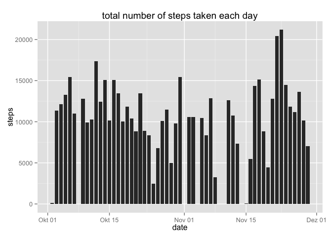
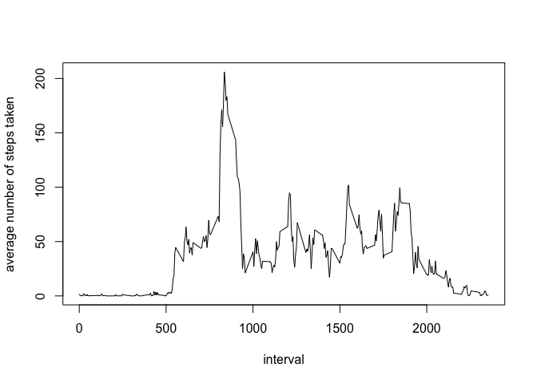
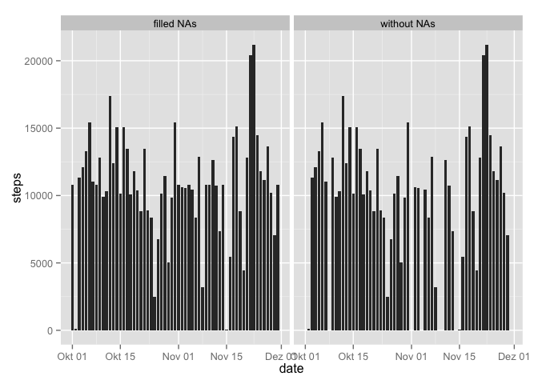

# Reproducible Research: Peer Assessment 1


## Loading and preprocessing the data
###1. Load the data

```r
activity <- read.csv(unzip("activity.zip", "activity.csv"), header=TRUE, sep=",")
```

###2. Process/transform the data (if necessary) into a format suitable for your analysis

```r
activity$date <- as.Date(activity$date, "%Y-%m-%d")
```
Optional: Make interval a 4 digit character (fill with leading zeros):

```r
activity$interval <- sprintf("%04d", activity$interval) 
```

## What is mean total number of steps taken per day?
###1. Calculate the total number of steps taken per day

```r
total_steps_pd <- aggregate(steps~date, data=activity, sum)
```

###2. If you do not understand the difference between a histogram and a barplot, research the difference between them. Make a histogram of the total number of steps taken each day

```r
library(ggplot2)
ggplot(total_steps_pd, aes(date, steps)) + geom_histogram(width=.8, stat="identity") + labs(title="total number of steps taken each day")
```

\

###3. Calculate and report the mean and median of the total number of steps taken per day
Depending on the interpretation of the question...
For each day:

```r
aggregate(steps~date, data=activity, mean)
```

```
##          date      steps
## 1  2012-10-02  0.4375000
## 2  2012-10-03 39.4166667
## 3  2012-10-04 42.0694444
## 4  2012-10-05 46.1597222
## 5  2012-10-06 53.5416667
## 6  2012-10-07 38.2465278
## 7  2012-10-09 44.4826389
## 8  2012-10-10 34.3750000
## 9  2012-10-11 35.7777778
## 10 2012-10-12 60.3541667
## 11 2012-10-13 43.1458333
## 12 2012-10-14 52.4236111
## 13 2012-10-15 35.2048611
## 14 2012-10-16 52.3750000
## 15 2012-10-17 46.7083333
## 16 2012-10-18 34.9166667
## 17 2012-10-19 41.0729167
## 18 2012-10-20 36.0937500
## 19 2012-10-21 30.6284722
## 20 2012-10-22 46.7361111
## 21 2012-10-23 30.9652778
## 22 2012-10-24 29.0104167
## 23 2012-10-25  8.6527778
## 24 2012-10-26 23.5347222
## 25 2012-10-27 35.1354167
## 26 2012-10-28 39.7847222
## 27 2012-10-29 17.4236111
## 28 2012-10-30 34.0937500
## 29 2012-10-31 53.5208333
## 30 2012-11-02 36.8055556
## 31 2012-11-03 36.7048611
## 32 2012-11-05 36.2465278
## 33 2012-11-06 28.9375000
## 34 2012-11-07 44.7326389
## 35 2012-11-08 11.1770833
## 36 2012-11-11 43.7777778
## 37 2012-11-12 37.3784722
## 38 2012-11-13 25.4722222
## 39 2012-11-15  0.1423611
## 40 2012-11-16 18.8923611
## 41 2012-11-17 49.7881944
## 42 2012-11-18 52.4652778
## 43 2012-11-19 30.6979167
## 44 2012-11-20 15.5277778
## 45 2012-11-21 44.3993056
## 46 2012-11-22 70.9270833
## 47 2012-11-23 73.5902778
## 48 2012-11-24 50.2708333
## 49 2012-11-25 41.0902778
## 50 2012-11-26 38.7569444
## 51 2012-11-27 47.3819444
## 52 2012-11-28 35.3576389
## 53 2012-11-29 24.4687500
```

```r
aggregate(steps~date, data=activity, median)
```

```
##          date steps
## 1  2012-10-02     0
## 2  2012-10-03     0
## 3  2012-10-04     0
## 4  2012-10-05     0
## 5  2012-10-06     0
## 6  2012-10-07     0
## 7  2012-10-09     0
## 8  2012-10-10     0
## 9  2012-10-11     0
## 10 2012-10-12     0
## 11 2012-10-13     0
## 12 2012-10-14     0
## 13 2012-10-15     0
## 14 2012-10-16     0
## 15 2012-10-17     0
## 16 2012-10-18     0
## 17 2012-10-19     0
## 18 2012-10-20     0
## 19 2012-10-21     0
## 20 2012-10-22     0
## 21 2012-10-23     0
## 22 2012-10-24     0
## 23 2012-10-25     0
## 24 2012-10-26     0
## 25 2012-10-27     0
## 26 2012-10-28     0
## 27 2012-10-29     0
## 28 2012-10-30     0
## 29 2012-10-31     0
## 30 2012-11-02     0
## 31 2012-11-03     0
## 32 2012-11-05     0
## 33 2012-11-06     0
## 34 2012-11-07     0
## 35 2012-11-08     0
## 36 2012-11-11     0
## 37 2012-11-12     0
## 38 2012-11-13     0
## 39 2012-11-15     0
## 40 2012-11-16     0
## 41 2012-11-17     0
## 42 2012-11-18     0
## 43 2012-11-19     0
## 44 2012-11-20     0
## 45 2012-11-21     0
## 46 2012-11-22     0
## 47 2012-11-23     0
## 48 2012-11-24     0
## 49 2012-11-25     0
## 50 2012-11-26     0
## 51 2012-11-27     0
## 52 2012-11-28     0
## 53 2012-11-29     0
```
For all days:

```r
mean(total_steps_pd$steps)
```

```
## [1] 10766.19
```

```r
median(total_steps_pd$steps)
```

```
## [1] 10765
```
Or simply:

```r
summary(total_steps_pd)
```

```
##       date                steps      
##  Min.   :2012-10-02   Min.   :   41  
##  1st Qu.:2012-10-16   1st Qu.: 8841  
##  Median :2012-10-29   Median :10765  
##  Mean   :2012-10-30   Mean   :10766  
##  3rd Qu.:2012-11-16   3rd Qu.:13294  
##  Max.   :2012-11-29   Max.   :21194
```

## What is the average daily activity pattern?

###1. Make a time series plot of the 5-minute interval (x-axis) and the average number of steps taken, averaged across all days (y-axis)

```r
mean_steps_pi <- aggregate(steps~interval, data=activity, mean)
plot(mean_steps_pi$interval, mean_steps_pi$steps, type="l", ylab="average number of steps taken", xlab="interval")
```

\

###2. Which 5-minute interval, on average across all the days in the dataset, contains the maximum number of steps?

```r
max_mean_steps <- mean_steps_pi[mean_steps_pi$steps == max(mean_steps_pi$steps), ]
max_mean_steps
```

```
##     interval    steps
## 104     0835 206.1698
```

## Imputing missing values

###1. Calculate and report the total number of missing values in the dataset (i.e. the total number of rows with NAs)

```r
sum(is.na(activity$steps))
```

```
## [1] 2304
```
Which makes up

```r
mean(is.na(activity$steps))
```

```
## [1] 0.1311475
```
in percent.

###2. Devise a strategy for filling in all of the missing values in the dataset. The strategy does not need to be sophisticated. For example, you could use the mean/median for that day, or the mean for that 5-minute interval, etc.
I decided to go for to mean steps per interval to supplement NA values.
First step is to create a new dataframe that only includes the NAs and merge it with the dataframe that includes all the mean steps by interval (merged by the invervals):

```r
activity_na_merged <- merge(x=activity[is.na(activity$steps),], y=mean_steps_pi, by.x="interval", by.y="interval")
```
As a next step I remove the NA column, write the result to a new dataframe and set the names accordingly:

```r
activity_na <- cbind(activity_na_merged[-2])
names(activity_na) <- c("interval","date","steps")
```


###3. Create a new dataset that is equal to the original dataset but with the missing data filled in.

Now I create a new dataframe from the original only containing the non-NAs (complete cases)...

```r
activity_wo_na <- activity[complete.cases(activity), ]
```
... and bind merge this one with the dataframe from the previous step (containing the mean values for each interval):

```r
activity_new <- rbind(activity_wo_na, activity_na)
```
There are no NAs in the new activity dataframe anymore:

```r
mean(is.na(activity_new$steps))
```

```
## [1] 0
```

###4. Make a histogram of the total number of steps taken each day and Calculate and report the mean and median total number of steps taken per day. Do these values differ from the estimates from the first part of the assignment? What is the impact of imputing missing data on the estimates of the total daily number of steps?

```r
total_steps_pd_new <- aggregate(steps~date, data=activity_new, sum)
total_steps_pd_new$nas <- 'filled NAs'
total_steps_pd$nas <- 'without NAs'
total_steps_histogram <- rbind(total_steps_pd, total_steps_pd_new)
ggplot(total_steps_histogram, aes(date, steps)) + geom_histogram(width=.8, stat="identity") + facet_grid(.~nas)
```

\
There definitly is an impact on a daily basis, especially when you look at the first half of the November timeframe.
When looking at the mean and median total number of steps taken per day, imputing the missing data does not have a big impact (only the median has gone up by 1, whereas the mean is still the same):

```r
summary(total_steps_pd_new)
```

```
##       date                steps           nas           
##  Min.   :2012-10-01   Min.   :   41   Length:61         
##  1st Qu.:2012-10-16   1st Qu.: 9819   Class :character  
##  Median :2012-10-31   Median :10766   Mode  :character  
##  Mean   :2012-10-31   Mean   :10766                     
##  3rd Qu.:2012-11-15   3rd Qu.:12811                     
##  Max.   :2012-11-30   Max.   :21194
```

```r
summary(total_steps_pd)
```

```
##       date                steps           nas           
##  Min.   :2012-10-02   Min.   :   41   Length:53         
##  1st Qu.:2012-10-16   1st Qu.: 8841   Class :character  
##  Median :2012-10-29   Median :10765   Mode  :character  
##  Mean   :2012-10-30   Mean   :10766                     
##  3rd Qu.:2012-11-16   3rd Qu.:13294                     
##  Max.   :2012-11-29   Max.   :21194
```

## Are there differences in activity patterns between weekdays and weekends?

###1. Create a new factor variable in the dataset with two levels – “weekday” and “weekend” indicating whether a given date is a weekday or weekend day.

Helper function that decides whether weekday is a weekday day or a weekend day (in this case I had to use the German words for "saturday" and "sunday"):

```r
is_weekday <- function(days) {
  wd <- c()
  for(i in 1:length(days)){
    if (weekdays(days[i]) %in% c("Samstag","Sonntag")) {
      wd <- c(wd, c="weekend")
    } else {
      wd <- c(wd, c="weekday")
    }
  }
  return(wd)
}
```
Create new factor variable:

```r
activity_new$weekday <- is_weekday(activity_new$date)
activity_new$weekday <- as.factor(activity_new$weekday)
```

###2. Make a panel plot containing a time series plot of the 5-minute interval (x-axis) and the average number of steps taken, averaged across all weekday days or weekend days (y-axis). See the README file in the GitHub repository to see an example of what this plot should look like using simulated data.

Create new dataframe and make interval numeric (important for x-axis scaling of the chart)...

```r
mean_steps_wd  <- aggregate(steps~interval+weekday, data=activity_new, mean)
mean_steps_wd$interval <- as.numeric(mean_steps_wd$interval)
```
...then create the visualization:

```r
ggplot(mean_steps_wd, aes(x=interval, y=steps, group=weekday)) + geom_line(stat="identity") + 
  facet_grid(weekday~.)+
  scale_x_continuous(breaks = seq(0,max(mean_steps_wd$interval),500))
```

\


